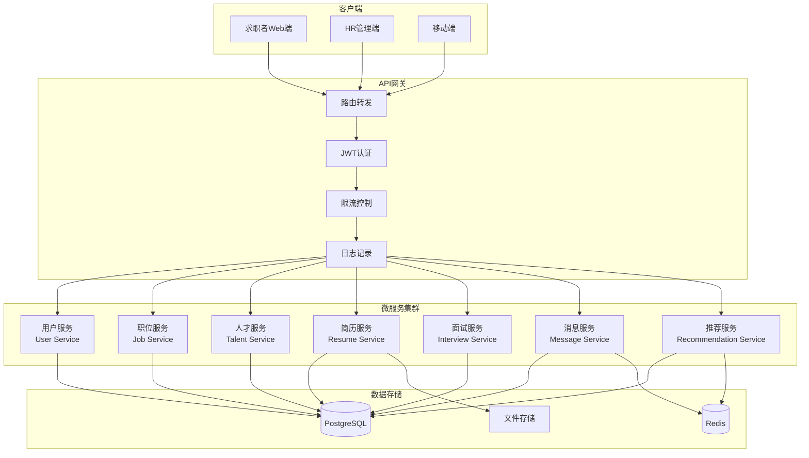
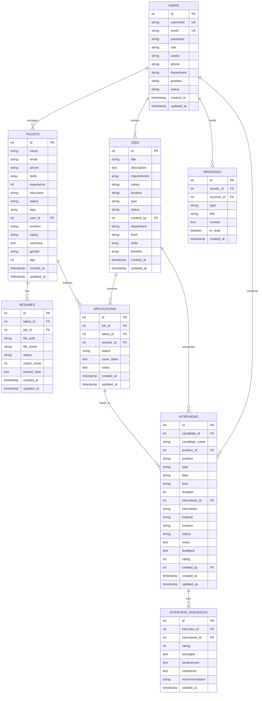
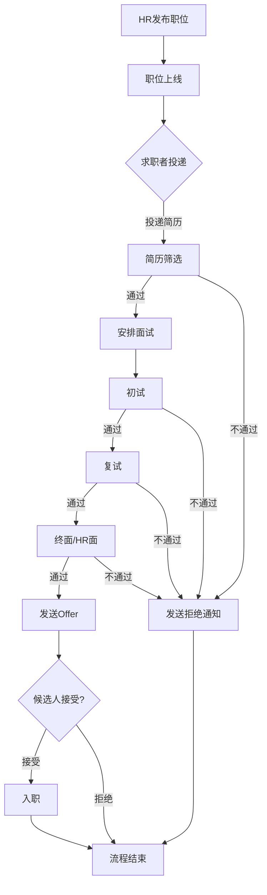
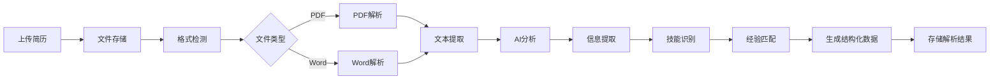
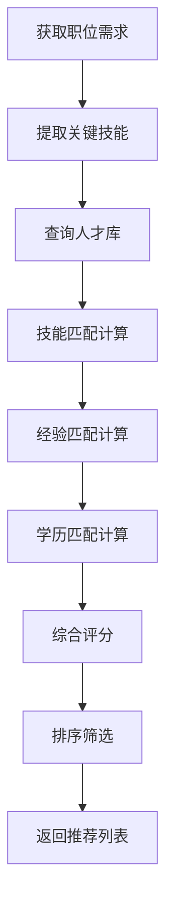

# 智能人才招聘平台 - 系统架构文档

## 1. 系统架构图

### 1.1 整体架构

```
┌─────────────────────────────────────────────────────────────────────────────┐
│                              客户端层 (Client Layer)                          │
├─────────────────────────────────┬───────────────────────────────────────────┤
│       求职者端 (Portal)          │           后台管理端 (Admin)                │
│   Vue3 + TypeScript + Vite      │      Vue3 + TypeScript + Element Plus     │
└─────────────────────────────────┴───────────────────────────────────────────┘
                                    │
                                    ▼
┌─────────────────────────────────────────────────────────────────────────────┐
│                              网关层 (Gateway Layer)                          │
│                                                                             │
│  ┌─────────────┐  ┌─────────────┐  ┌─────────────┐  ┌─────────────┐        │
│  │   路由转发   │  │   认证鉴权   │  │   限流熔断   │  │   日志记录   │        │
│  └─────────────┘  └─────────────┘  └─────────────┘  └─────────────┘        │
│                           API Gateway (Go + Gin)                            │
└─────────────────────────────────────────────────────────────────────────────┘
                                    │
                                    ▼
┌─────────────────────────────────────────────────────────────────────────────┐
│                              服务层 (Service Layer)                          │
│                                                                             │
│  ┌──────────────┐  ┌──────────────┐  ┌──────────────┐  ┌──────────────┐    │
│  │ User Service │  │ Job Service  │  │Talent Service│  │Resume Service│    │
│  │   用户服务    │  │   职位服务    │  │   人才服务    │  │   简历服务    │    │
│  │  :8081       │  │  :8082       │  │  :8083       │  │  :8084       │    │
│  └──────────────┘  └──────────────┘  └──────────────┘  └──────────────┘    │
│                                                                             │
│  ┌──────────────┐  ┌──────────────┐  ┌──────────────┐                      │
│  │Interview Svc │  │ Message Svc  │  │Recommend Svc │                      │
│  │   面试服务    │  │   消息服务    │  │   推荐服务    │                      │
│  │  :8085       │  │  :8086       │  │  :8087       │                      │
│  └──────────────┘  └──────────────┘  └──────────────┘                      │
└─────────────────────────────────────────────────────────────────────────────┘
                                    │
                                    ▼
┌─────────────────────────────────────────────────────────────────────────────┐
│                              数据层 (Data Layer)                             │
│                                                                             │
│  ┌──────────────────────┐  ┌──────────────────────┐  ┌─────────────────┐   │
│  │     PostgreSQL       │  │        Redis         │  │   File Storage  │   │
│  │      主数据库         │  │      缓存/会话        │  │    文件存储      │   │
│  └──────────────────────┘  └──────────────────────┘  └─────────────────┘   │
└─────────────────────────────────────────────────────────────────────────────┘
```

### 1.2 微服务架构详图



---

## 2. 数据库 ER 图

### 2.1 核心实体关系图



### 2.2 数据表说明

| 表名 | 说明 | 主要字段 |
|------|------|----------|
| users | 用户表 | 存储系统用户信息，包括管理员、HR、面试官等 |
| talents | 人才表 | 存储候选人信息，包括技能、经验、教育背景等 |
| jobs | 职位表 | 存储招聘职位信息，包括要求、薪资、福利等 |
| resumes | 简历表 | 存储简历文件信息和解析结果 |
| applications | 申请表 | 记录候选人的职位申请 |
| interviews | 面试表 | 存储面试安排信息 |
| interview_feedbacks | 面试反馈表 | 存储面试官的评价反馈 |
| messages | 消息表 | 存储系统消息和用户通知 |

---

## 3. 业务流程图

### 3.1 招聘流程



### 3.2 简历解析流程



### 3.3 智能推荐流程



---

## 4. 技术栈说明

### 4.1 前端技术栈

| 技术 | 版本 | 用途 |
|------|------|------|
| Vue.js | 3.x | 前端框架 |
| TypeScript | 5.x | 类型安全 |
| Vite | 5.x | 构建工具 |
| Element Plus | 2.x | UI组件库 |
| Pinia | 2.x | 状态管理 |
| Vue Router | 4.x | 路由管理 |
| ECharts | 5.x | 数据可视化 |
| Axios | 1.x | HTTP客户端 |

### 4.2 后端技术栈

| 技术 | 版本 | 用途 |
|------|------|------|
| Go | 1.21+ | 后端语言 |
| Gin | 1.9+ | Web框架 |
| GORM | 1.25+ | ORM框架 |
| JWT | - | 身份认证 |
| PostgreSQL | 14+ | 主数据库 |
| Redis | 6+ | 缓存/会话 |

### 4.3 部署技术

| 技术 | 用途 |
|------|------|
| Docker | 容器化 |
| Docker Compose | 容器编排 |
| Nginx | 反向代理 |
| GitHub Actions | CI/CD |

---

## 5. 安全设计

### 5.1 认证授权

- JWT Token 认证
- 基于角色的访问控制 (RBAC)
- 细粒度权限管理

### 5.2 数据安全

- 密码 bcrypt 加密存储
- 敏感数据脱敏显示
- SQL 注入防护
- XSS 攻击防护

### 5.3 传输安全

- HTTPS 加密传输
- API 请求签名
- 请求频率限制
