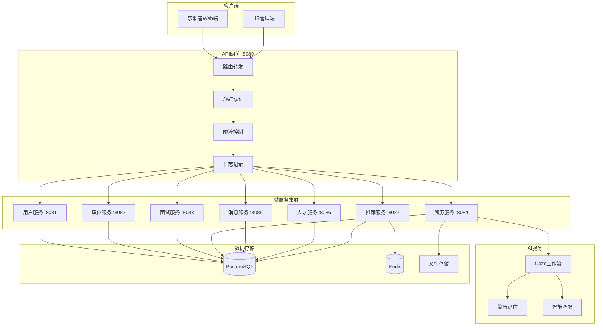
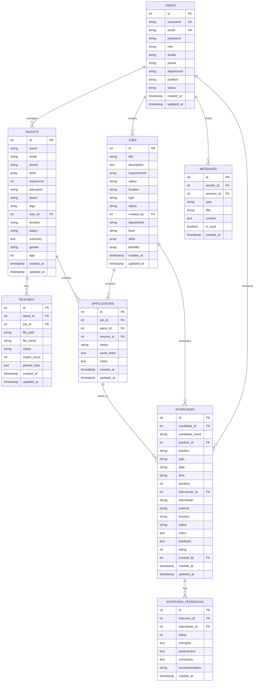
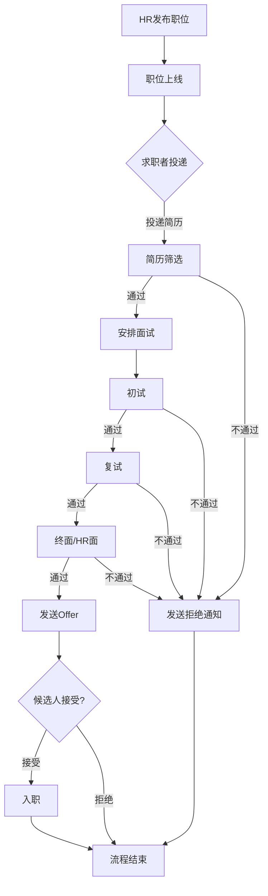
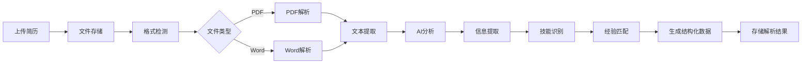
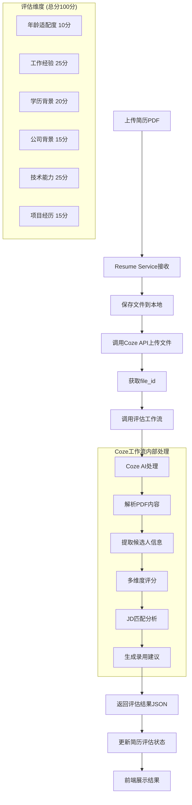
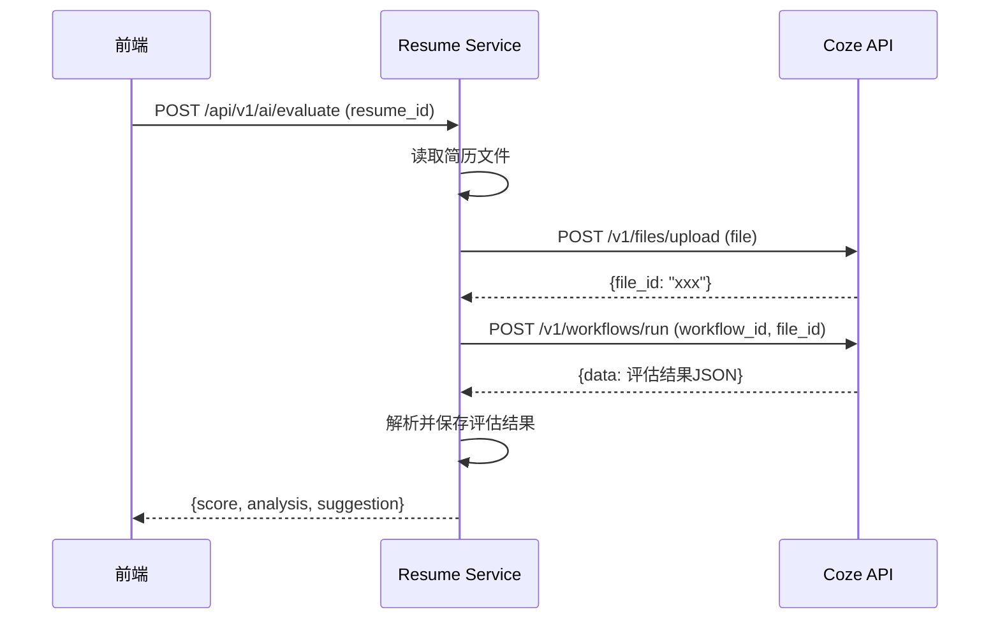
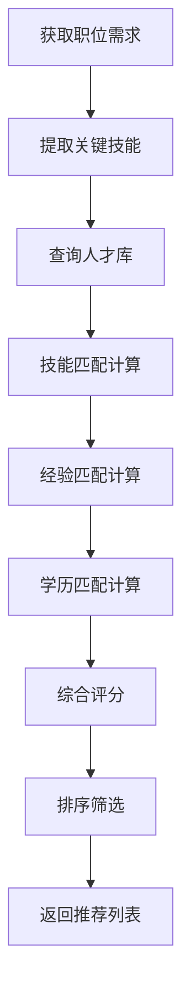

# 智能人才招聘平台 - 系统架构文档

## 1. 系统架构图

### 1.1 整体架构

```
┌─────────────────────────────────────────────────────────────────────────────┐
│                              客户端层 (Client Layer)                          │
├─────────────────────────────────┬───────────────────────────────────────────┤
│       求职者端 (Portal)          │           后台管理端 (Admin)                │
│   Vue3 + TypeScript + Vite      │      Vue3 + TypeScript + Element Plus     │
│         :5173                   │              :5173                        │
└─────────────────────────────────┴───────────────────────────────────────────┘
                                    │
                                    ▼
┌─────────────────────────────────────────────────────────────────────────────┐
│                              网关层 (Gateway Layer)                          │
│                                                                             │
│  ┌─────────────┐  ┌─────────────┐  ┌─────────────┐  ┌─────────────┐        │
│  │   路由转发   │  │   认证鉴权   │  │   限流熔断   │  │   日志记录   │        │
│  └─────────────┘  └─────────────┘  └─────────────┘  └─────────────┘        │
│                       API Gateway (Go + Gin) :8080                          │
└─────────────────────────────────────────────────────────────────────────────┘
                                    │
                                    ▼
┌─────────────────────────────────────────────────────────────────────────────┐
│                              服务层 (Service Layer)                          │
│                                                                             │
│  ┌──────────────┐  ┌──────────────┐  ┌──────────────┐  ┌──────────────┐    │
│  │ User Service │  │ Job Service  │  │Interview Svc │  │Resume Service│    │
│  │   用户服务    │  │   职位服务    │  │   面试服务    │  │   简历服务    │    │
│  │    :8081     │  │    :8082     │  │    :8083     │  │    :8084     │    │
│  └──────────────┘  └──────────────┘  └──────────────┘  └──────────────┘    │
│                                                                             │
│  ┌──────────────┐  ┌──────────────┐  ┌──────────────┐                      │
│  │ Message Svc  │  │Talent Service│  │Recommend Svc │                      │
│  │   消息服务    │  │   人才服务    │  │   推荐服务    │                      │
│  │    :8085     │  │    :8086     │  │    :8087     │                      │
│  └──────────────┘  └──────────────┘  └──────────────┘                      │
└─────────────────────────────────────────────────────────────────────────────┘
                                    │
                    ┌───────────────┼───────────────┐
                    ▼               ▼               ▼
┌─────────────────────────────────────────────────────────────────────────────┐
│                              数据层 (Data Layer)                             │
│                                                                             │
│  ┌──────────────────────┐  ┌──────────────────────┐  ┌─────────────────┐   │
│  │     PostgreSQL       │  │        Redis         │  │   File Storage  │   │
│  │      主数据库         │  │      缓存/会话        │  │    文件存储      │   │
│  │       :5432          │  │       :6379          │  │   ./uploads     │   │
│  └──────────────────────┘  └──────────────────────┘  └─────────────────┘   │
└─────────────────────────────────────────────────────────────────────────────┘
                                    │
                                    ▼
┌─────────────────────────────────────────────────────────────────────────────┐
│                           AI服务层 (AI Service Layer)                        │
│                                                                             │
│  ┌─────────────────────────────────────────────────────────────────────┐   │
│  │                      Coze AI 工作流服务                               │   │
│  │  ┌─────────────┐  ┌─────────────┐  ┌─────────────┐  ┌────────────┐  │   │
│  │  │  简历解析    │  │  智能评分    │  │  JD匹配     │  │  录用建议   │  │   │
│  │  └─────────────┘  └─────────────┘  └─────────────┘  └────────────┘  │   │
│  └─────────────────────────────────────────────────────────────────────┘   │
└─────────────────────────────────────────────────────────────────────────────┘
```

### 1.2 服务端口配置

| 服务名称 | 端口 | 说明 |
|---------|------|------|
| Frontend | 5173 | 前端开发服务器 |
| Gateway | 8080 | API网关（可选） |
| User Service | 8081 | 用户认证、权限管理 |
| Job Service | 8082 | 职位CRUD、搜索筛选 |
| Interview Service | 8083 | 面试安排、反馈管理 |
| Resume Service | 8084 | 简历上传、AI评估 |
| Message Service | 8085 | 消息通知、未读统计 |
| Talent Service | 8086 | 人才库管理、搜索 |
| Recommendation Service | 8087 | 智能推荐（待完善） |
| PostgreSQL | 5432 | 主数据库 |
| Redis | 6379 | 缓存服务（可选） |

### 1.3 微服务架构详图



---

## 2. 数据库 ER 图

### 2.1 核心实体关系图



### 2.2 数据表说明

| 表名 | 说明 | 主要字段 |
|------|------|----------|
| users | 用户表 | 存储系统用户信息，包括管理员、HR、面试官等 |
| talents | 人才表 | 存储候选人信息，包括技能、经验、教育背景等 |
| jobs | 职位表 | 存储招聘职位信息，包括要求、薪资、福利等 |
| resumes | 简历表 | 存储简历文件信息和解析结果 |
| applications | 申请表 | 记录候选人的职位申请 |
| interviews | 面试表 | 存储面试安排信息 |
| interview_feedbacks | 面试反馈表 | 存储面试官的评价反馈 |
| messages | 消息表 | 存储系统消息和用户通知 |

---

## 3. 业务流程图

### 3.1 招聘流程



### 3.2 简历解析流程



### 3.3 AI 智能评估流程（Coze 工作流）



### 3.4 Coze API 调用流程



### 3.5 评估结果数据结构

```json
{
  "code": 0,
  "message": "评估完成",
  "data": {
    "resume_id": 1,
    "total_score": 85,
    "dimensions": {
      "age": {"score": 8, "max": 10, "comment": "年龄适中"},
      "experience": {"score": 22, "max": 25, "comment": "5年相关经验"},
      "education": {"score": 18, "max": 20, "comment": "985本科"},
      "company": {"score": 12, "max": 15, "comment": "知名互联网公司"},
      "skills": {"score": 20, "max": 25, "comment": "技术栈匹配度高"},
      "projects": {"score": 5, "max": 15, "comment": "项目经历一般"}
    },
    "jd_match": {
      "match_rate": 82,
      "matched_skills": ["Go", "Vue", "PostgreSQL"],
      "missing_skills": ["Kubernetes"]
    },
    "suggestion": "建议录用",
    "summary": "候选人整体素质较好，技术能力突出，建议进入面试环节"
  }
}
```

### 3.6 智能推荐流程



---

## 4. Coze AI 集成说明

### 4.1 Coze 工作流配置

| 配置项 | 说明 |
|-------|------|
| COZE_API_TOKEN | Coze平台API访问令牌 |
| COZE_WORKFLOW_ID | 简历评估工作流ID |
| COZE_BOT_ID | 机器人ID（可选） |

### 4.2 环境变量配置

```bash
# .env 文件
COZE_API_TOKEN=pat_xxxxxxxxxxxxxxxx
COZE_WORKFLOW_ID=7xxxxxxxxxxxxxxxxxx
COZE_BOT_ID=7xxxxxxxxxxxxxxxxxx
```

### 4.3 API 接口

| 接口 | 方法 | 说明 |
|-----|------|------|
| /api/v1/ai/config | GET | 检查AI配置状态 |
| /api/v1/ai/evaluate | POST | 评估指定简历 |
| /api/v1/ai/evaluate/upload | POST | 上传并评估简历 |
| /api/v1/ai/evaluate/batch | POST | 批量评估简历 |
| /api/v1/ai/evaluate/:id/result | GET | 获取评估结果 |

### 4.4 工作流设计

Coze工作流接收简历文件，执行以下步骤：

1. **文件解析**: 提取PDF/Word文档中的文本内容
2. **信息抽取**: 识别姓名、联系方式、教育背景、工作经历等
3. **技能识别**: 提取技术技能、软技能
4. **多维评分**: 按6个维度进行评分
5. **JD匹配**: 与职位要求进行匹配分析
6. **建议生成**: 输出录用建议和综合评价

---

## 5. 技术栈说明

### 5.1 前端技术栈

| 技术 | 版本 | 用途 |
|------|------|------|
| Vue.js | 3.x | 前端框架 |
| TypeScript | 5.x | 类型安全 |
| Vite | 5.x | 构建工具 |
| Element Plus | 2.x | UI组件库 |
| Pinia | 2.x | 状态管理 |
| Vue Router | 4.x | 路由管理 |
| ECharts | 5.x | 数据可视化 |
| Axios | 1.x | HTTP客户端 |
| Vitest | 1.x | 单元测试 |

### 5.2 后端技术栈

| 技术 | 版本 | 用途 |
|------|------|------|
| Go | 1.21+ | 后端语言 |
| Gin | 1.9+ | Web框架 |
| GORM | 1.25+ | ORM框架 |
| JWT | - | 身份认证 |
| bcrypt | - | 密码加密 |
| PostgreSQL | 14+ | 主数据库 |
| Redis | 6+ | 缓存/会话（可选） |

### 5.3 AI服务

| 技术 | 用途 |
|------|------|
| Coze API | AI工作流平台 |
| Coze Workflow | 简历智能评估 |

### 5.4 部署技术

| 技术 | 用途 |
|------|------|
| Docker | 容器化 |
| Docker Compose | 容器编排 |
| Nginx | 反向代理 |
| GitHub Actions | CI/CD |

---

## 6. 安全设计

### 6.1 认证授权

- JWT Token 认证
- 基于角色的访问控制 (RBAC)
- 细粒度权限管理
- Token 过期自动刷新

### 6.2 数据安全

- 密码 bcrypt 加密存储
- 敏感数据脱敏显示
- SQL 注入防护（GORM参数化查询）
- XSS 攻击防护

### 6.3 传输安全

- HTTPS 加密传输
- CORS 跨域配置
- 请求频率限制

### 6.4 文件安全

- 文件类型白名单（PDF、DOC、DOCX）
- 文件大小限制（10MB）
- 文件存储路径隔离

---

## 7. 目录结构

```
graduate/
├── frontend/                    # 前端项目
│   ├── src/
│   │   ├── api/                # API接口
│   │   ├── components/         # 组件
│   │   ├── views/              # 页面
│   │   ├── store/              # 状态管理
│   │   ├── router/             # 路由
│   │   └── utils/              # 工具函数
│   └── package.json
│
├── backend/                     # 后端项目
│   ├── user-service/           # 用户服务 :8081
│   ├── job-service/            # 职位服务 :8082
│   ├── interview-service/      # 面试服务 :8083
│   ├── resume-service/         # 简历服务 :8084 (含AI评估)
│   ├── message-service/        # 消息服务 :8085
│   ├── talent-service/         # 人才服务 :8086
│   ├── recommendation-service/ # 推荐服务 :8087
│   ├── gateway/                # API网关 :8080
│   ├── common/                 # 公共模块
│   ├── database/               # 数据库脚本
│   └── test_api.sh             # API测试脚本
│
├── docs/                        # 文档
│   ├── ARCHITECTURE.md         # 架构文档
│   ├── QUICKSTART.md           # 快速启动
│   ├── DEPLOYMENT.md           # 部署文档
│   └── TEST_GUIDE.md           # 测试指南
│
├── docker-compose.yml          # Docker编排
└── README.md                   # 项目说明
```

---

## 8. 测试覆盖

### 8.1 后端测试

- API测试脚本: `backend/test_api.sh`
- 测试用例: 74个
- 覆盖服务: 全部6个微服务

### 8.2 前端测试

- 测试框架: Vitest
- 测试用例: 81个
- 覆盖范围: API、组件、工具函数、状态管理
