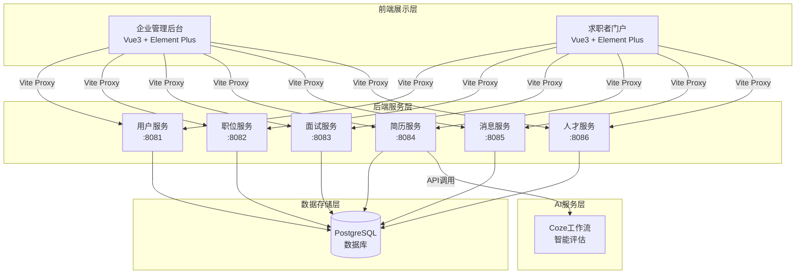
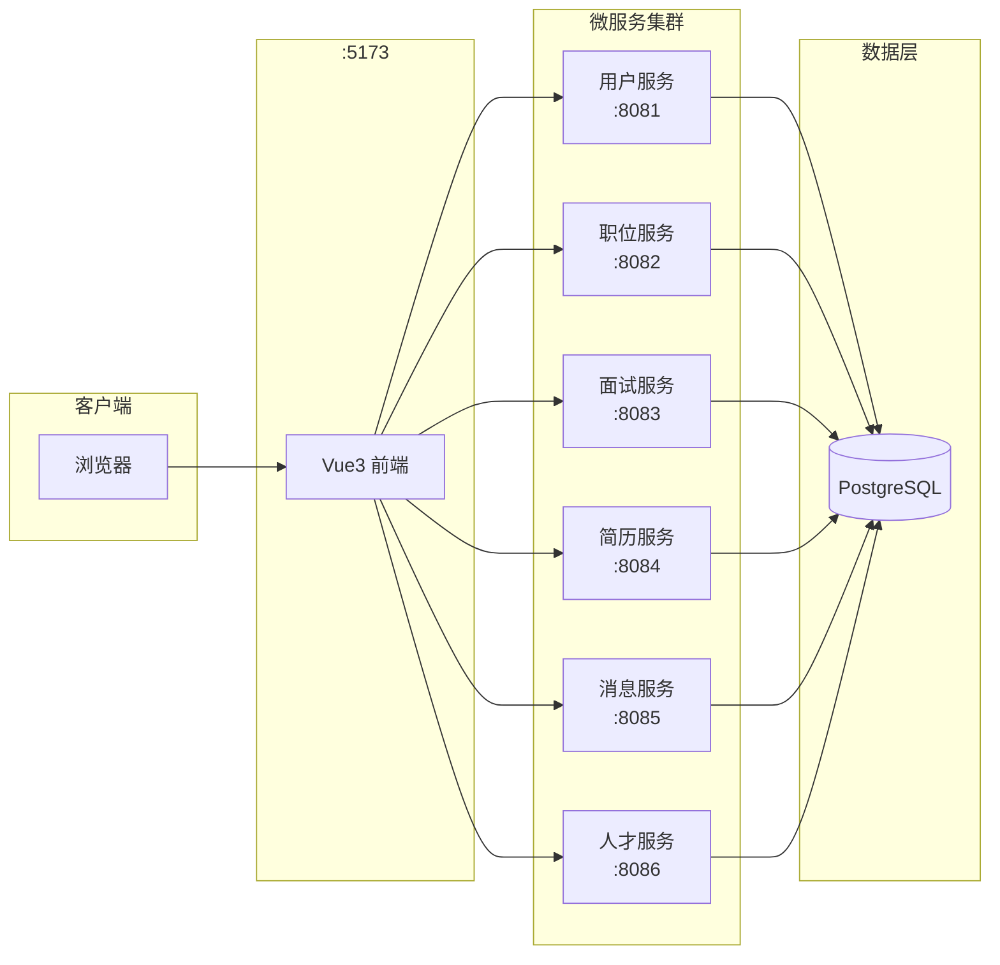
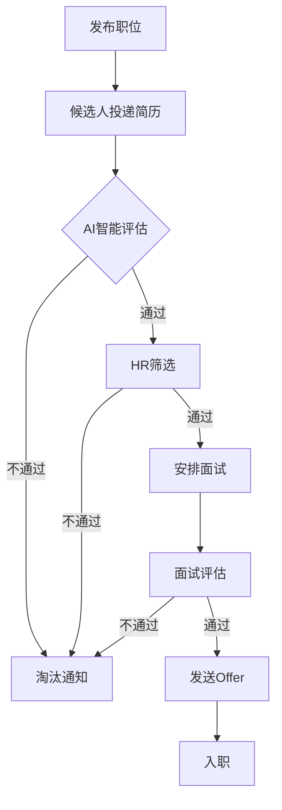
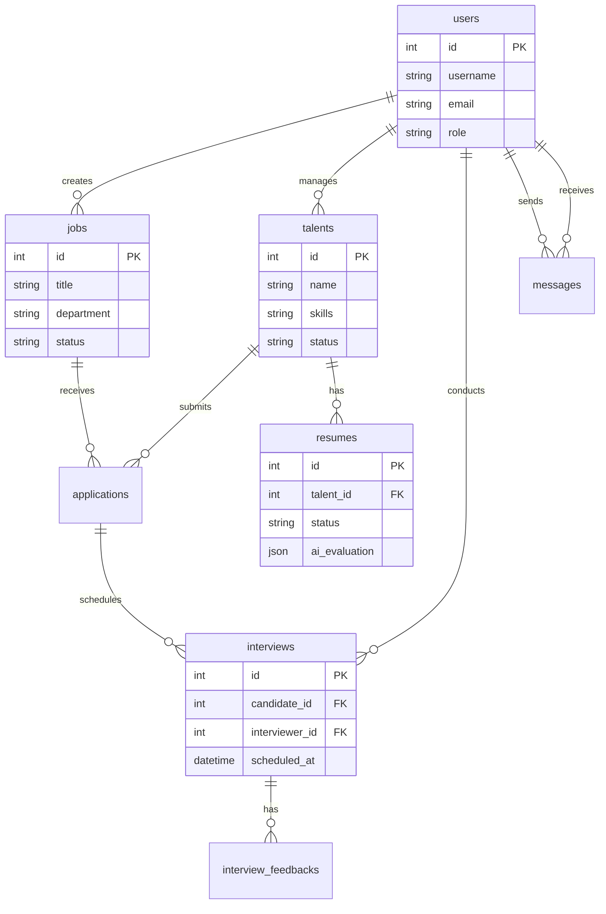
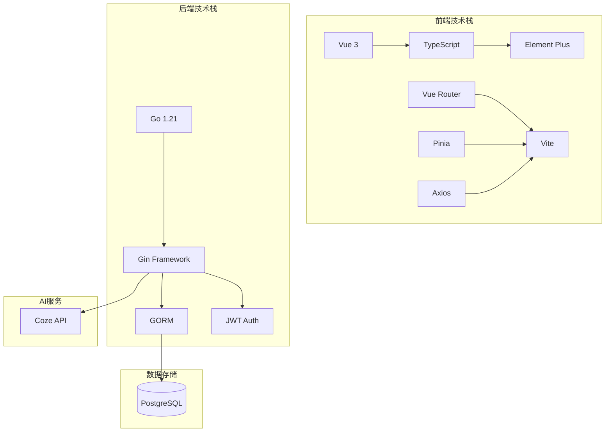
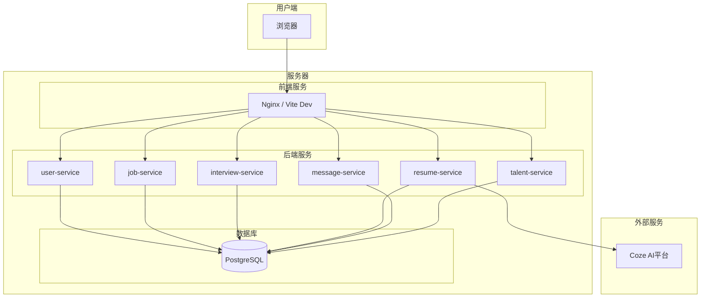

# 架构图 Mermaid 代码

使用方法：复制代码到 https://mermaid.live 生成图片并导出

---

## 1. 系统整体架构图

```mermaid
flowchart TB
    subgraph 前端展示层
        A1[企业管理后台<br/>Vue3 + Element Plus]
        A2[求职者门户<br/>Vue3 + Element Plus]
    end
    
    subgraph 后端服务层
        B1[用户服务<br/>:8081]
        B2[职位服务<br/>:8082]
        B3[面试服务<br/>:8083]
        B4[简历服务<br/>:8084]
        B5[消息服务<br/>:8085]
        B6[人才服务<br/>:8086]
    end
    
    subgraph 数据存储层
        C1[(PostgreSQL<br/>数据库)]
    end
    
    subgraph AI服务层
        D1[Coze工作流<br/>智能评估]
    end
    
    A1 & A2 -->|Vite Proxy| B1 & B2 & B3 & B4 & B5 & B6
    B1 & B2 & B3 & B4 & B5 & B6 --> C1
    B4 -->|API调用| D1
```

---

## 2. 微服务架构图

```mermaid
flowchart LR
    subgraph 客户端
        Client[浏览器]
    end
    
    subgraph 前端 [:5173]
        FE[Vue3 前端]
    end
    
    subgraph 微服务集群
        US[用户服务<br/>:8081]
        JS[职位服务<br/>:8082]
        IS[面试服务<br/>:8083]
        RS[简历服务<br/>:8084]
        MS[消息服务<br/>:8085]
        TS[人才服务<br/>:8086]
    end
    
    subgraph 数据层
        DB[(PostgreSQL)]
    end
    
    Client --> FE
    FE --> US & JS & IS & RS & MS & TS
    US & JS & IS & RS & MS & TS --> DB
```

---

## 3. 业务流程图 - 招聘流程

```mermaid
flowchart TD
    A[发布职位] --> B[候选人投递简历]
    B --> C{AI智能评估}
    C -->|通过| D[HR筛选]
    C -->|不通过| E[淘汰通知]
    D -->|通过| F[安排面试]
    D -->|不通过| E
    F --> G[面试评估]
    G -->|通过| H[发送Offer]
    G -->|不通过| E
    H --> I[入职]
```

---

## 4. 数据库ER图

```mermaid
erDiagram
    users ||--o{ jobs : creates
    users ||--o{ talents : manages
    users ||--o{ interviews : conducts
    
    jobs ||--o{ applications : receives
    talents ||--o{ applications : submits
    talents ||--o{ resumes : has
    
    applications ||--o{ interviews : schedules
    interviews ||--o{ interview_feedbacks : has
    
    users ||--o{ messages : sends
    users ||--o{ messages : receives
    
    users {
        int id PK
        string username
        string email
        string role
    }
    
    jobs {
        int id PK
        string title
        string department
        string status
    }
    
    talents {
        int id PK
        string name
        string skills
        string status
    }
    
    resumes {
        int id PK
        int talent_id FK
        string status
        json ai_evaluation
    }
    
    interviews {
        int id PK
        int candidate_id FK
        int interviewer_id FK
        datetime scheduled_at
    }
```

---

## 5. 技术栈架构图

```mermaid
flowchart TB
    subgraph 前端技术栈
        V[Vue 3]
        TS[TypeScript]
        EP[Element Plus]
        VR[Vue Router]
        P[Pinia]
        AX[Axios]
        VI[Vite]
    end
    
    subgraph 后端技术栈
        GO[Go 1.21]
        GIN[Gin Framework]
        GORM[GORM]
        JWT[JWT Auth]
    end
    
    subgraph 数据存储
        PG[(PostgreSQL)]
    end
    
    subgraph AI服务
        COZE[Coze API]
    end
    
    V --> TS --> EP
    VR & P & AX --> VI
    GO --> GIN --> GORM --> PG
    GIN --> JWT
    GIN --> COZE
```

---

## 6. 部署架构图

```mermaid
flowchart TB
    subgraph 用户端
        Browser[浏览器]
    end
    
    subgraph 服务器
        subgraph 前端服务
            Nginx[Nginx / Vite Dev]
        end
        
        subgraph 后端服务
            S1[user-service]
            S2[job-service]
            S3[interview-service]
            S4[resume-service]
            S5[message-service]
            S6[talent-service]
        end
        
        subgraph 数据库
            DB[(PostgreSQL)]
        end
    end
    
    subgraph 外部服务
        Coze[Coze AI平台]
    end
    
    Browser --> Nginx
    Nginx --> S1 & S2 & S3 & S4 & S5 & S6
    S1 & S2 & S3 & S4 & S5 & S6 --> DB
    S4 --> Coze
```
