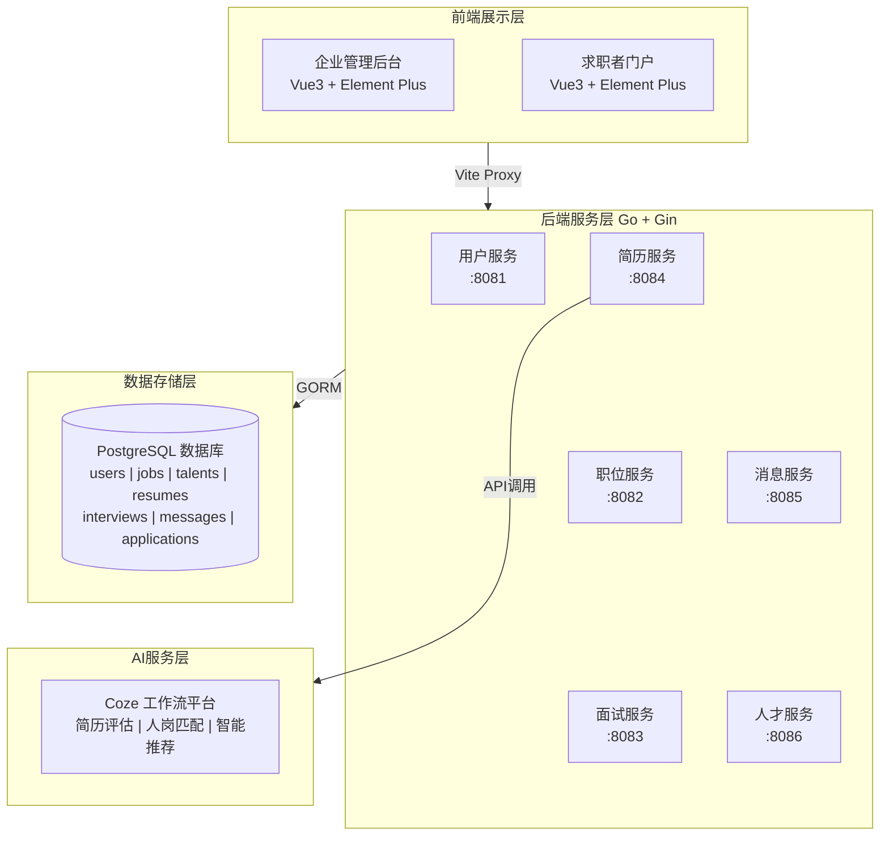
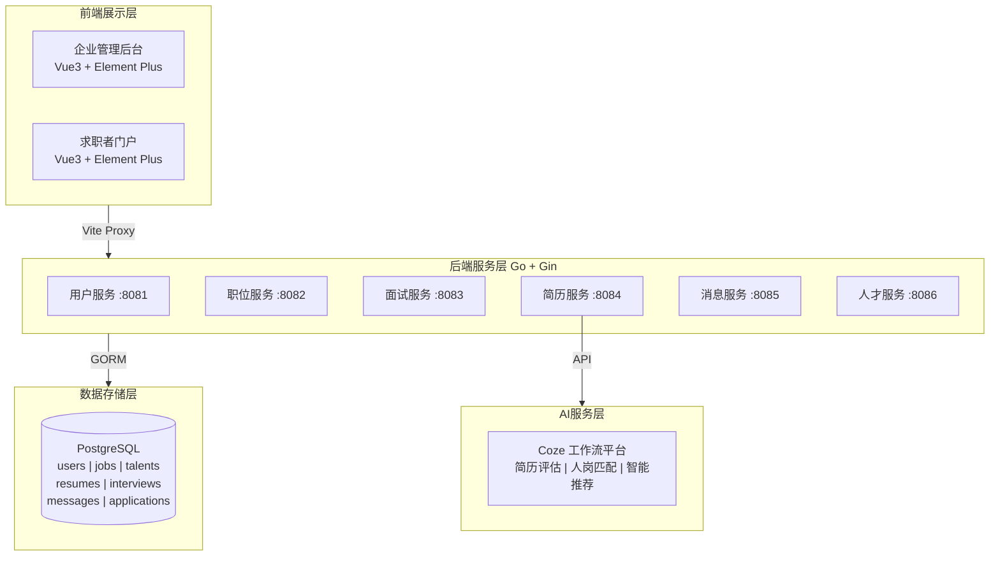
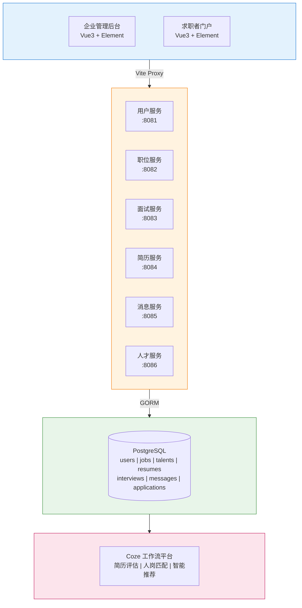

# 系统架构图 Mermaid 代码

复制下面的代码到 https://mermaid.live 生成图片

---

## 居中对齐版本（推荐）

```mermaid
flowchart TB
    subgraph Layer1["前端展示层"]
        A1["企业管理后台<br/>Vue3 + Element Plus"] ~~~ A2["求职者门户<br/>Vue3 + Element Plus"]
    end
    
    Layer1 -->|"Vite Proxy"| Layer2
    
    subgraph Layer2["后端服务层 Go + Gin"]
        B1["用户服务<br/>:8081"] ~~~ B2["职位服务<br/>:8082"] ~~~ B3["面试服务<br/>:8083"]
        B4["简历服务<br/>:8084"] ~~~ B5["消息服务<br/>:8085"] ~~~ B6["人才服务<br/>:8086"]
    end
    
    Layer2 -->|"GORM"| Layer3
    
    subgraph Layer3["数据存储层"]
        C1[("PostgreSQL 数据库<br/>users | jobs | talents | resumes<br/>interviews | messages | applications")]
    end
    
    Layer3 ~~~ Layer4
    B4 -->|"API调用"| Layer4
    
    subgraph Layer4["AI服务层"]
        D1["Coze 工作流平台<br/>简历评估 | 人岗匹配 | 智能推荐"]
    end
```

---

## 纯净版本（无emoji）

```mermaid
flowchart TB
    subgraph FE["前端展示层"]
        direction LR
        FE1["企业管理后台<br/>Vue3 + Element Plus"]
        FE2["求职者门户<br/>Vue3 + Element Plus"]
    end
    
    FE --> |"Vite Proxy"| BE
    
    subgraph BE["后端服务层 Go + Gin"]
        direction LR
        BE1["用户服务 :8081"]
        BE2["职位服务 :8082"]
        BE3["面试服务 :8083"]
        BE4["简历服务 :8084"]
        BE5["消息服务 :8085"]
        BE6["人才服务 :8086"]
    end
    
    BE --> |"GORM"| DB
    BE4 --> |"API"| AI
    
    subgraph DB["数据存储层"]
        DB1[("PostgreSQL<br/>users | jobs | talents<br/>resumes | interviews<br/>messages | applications")]
    end
    
    subgraph AI["AI服务层"]
        AI1["Coze 工作流平台<br/>简历评估 | 人岗匹配 | 智能推荐"]
    end
```

---

## 垂直居中版本

```mermaid
flowchart TB
    subgraph L1[" "]
        direction LR
        space1[" "] ~~~ FE1["企业管理后台<br/>Vue3 + Element"] ~~~ FE2["求职者门户<br/>Vue3 + Element"] ~~~ space2[" "]
    end
    
    L1 -->|Vite Proxy| L2
    
    subgraph L2[" "]
        direction LR
        S1["用户服务<br/>:8081"]
        S2["职位服务<br/>:8082"]
        S3["面试服务<br/>:8083"]
        S4["简历服务<br/>:8084"]
        S5["消息服务<br/>:8085"]
        S6["人才服务<br/>:8086"]
    end
    
    L2 -->|GORM| L3
    
    subgraph L3[" "]
        direction LR
        sp3[" "] ~~~ DB[("PostgreSQL<br/>users | jobs | talents | resumes<br/>interviews | messages | applications")] ~~~ sp4[" "]
    end
    
    L3 --> L4
    
    subgraph L4[" "]
        direction LR
        sp5[" "] ~~~ COZE["Coze 工作流平台<br/>简历评估 | 人岗匹配 | 智能推荐"] ~~~ sp6[" "]
    end
    
    style L1 fill:#e3f2fd,stroke:#1976d2
    style L2 fill:#fff3e0,stroke:#f57c00
    style L3 fill:#e8f5e9,stroke:#388e3c
    style L4 fill:#fce4ec,stroke:#c2185b
    style space1 fill:none,stroke:none
    style space2 fill:none,stroke:none
    style sp3 fill:none,stroke:none
    style sp4 fill:none,stroke:none
    style sp5 fill:none,stroke:none
    style sp6 fill:none,stroke:none
```
